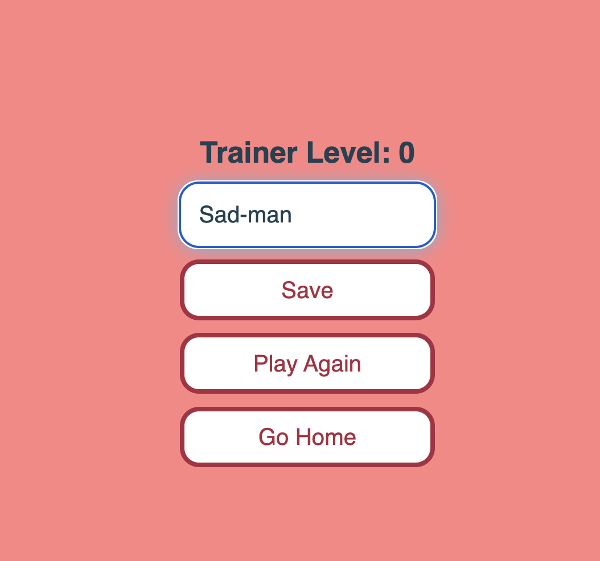
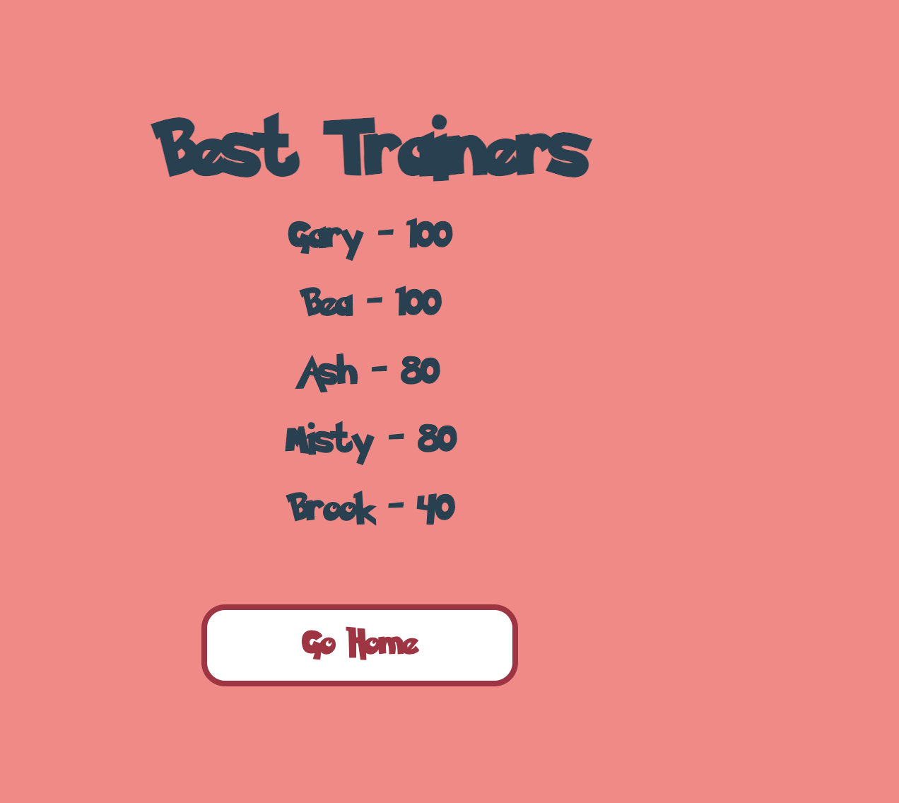

# Pokequiz
This is a Quiz App of your Favorite Subject: Pokemon! (Yeaiiii!)

This will be located on my repository: https://github.com/mxmar0k/Pokequiz

And it will be live at:  https://mxmar0k.github.io/Pokequiz/

This is a pokemon quiz app based for styling purposes using this color palette https://pokepalettes.com/#tangela
Also I used (starts crying) https://fonts.cdnfonts.com/css/pokemon-solid this font size someone with 8 medals did.

The app consists of:

Index.html which is the main menu where you can check your highscores and play the game:
 18.56.49.png>)
Also we have a maincss.css file which has a lot of corrections in subsecuent css files.

Then we have a main game quiz js and html and css.
The most important thing is we created and object-arrar with somequestions (there can be more, but im too tired, i want to sleep and eat)
the questions are randomly selected and we have a timer function that passes over the next question if the timer is over.
we also keep a score up to 100.
I tried to keep it pokemon related so you will find some references.
 19.01.21.png>)

in the next example i let the time run, so i got 0 points, when the game is over it redirects you to the results page and lets you log in your id (but only a max of 5 highscores ids will be kept on the highscore tabs)

The final page is the hightscore js, htm, css, where you can see who's the better trainer (Gary, of course).

Credits:

I want to thank my professor and my TA for amazing lessons, and also the beautiful people on the internet.

HAVE A GREAT WEEK OR WEEKEND, DEPENDING WHEN YOU WATCH THIS.

ps. i really still still dont know how to make a readme.

